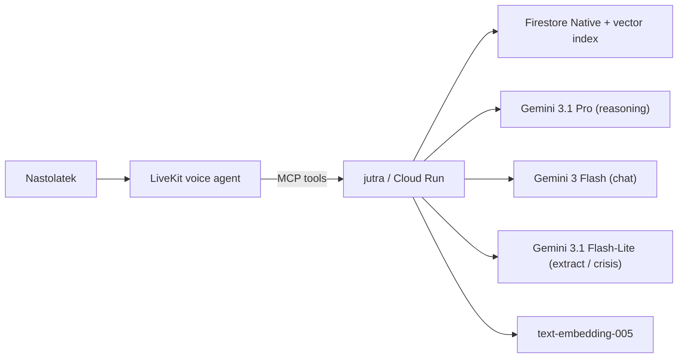

# jutra

> Rozmawiaj ze swoim cyfrowym "jutro". 15-letni Alex pyta siebie z przyszlosci
> (za 5 / 10 / 20 / 30 lat) o wazne decyzje. Backend buduje persone na bazie
> psychologicznych modeli (OCEAN + Maturity Principle + Erikson + RIASEC),
> karmi ja postami z social mediow (RAG wektorowy), a FutureSelf_N odpowiada
> zywym glosem przez LiveKit.

24-godzinny projekt hackathonowy. Ten backend wystawia REST + MCP i jest
konsumowany przez voice-UI na LiveKit (prowadzone przez kolege).

## Architektura



- Agents: Google ADK 1.31 (`LlmAgent`, `SequentialAgent`, `Runner`).
- LLMs (Vertex AI):
  - `gemini-3.1-pro-preview` — `FutureSelf_30` (reasoning, mentor na 30 lat).
  - `gemini-3-flash-preview` — `FutureSelf_5/10/20` + `ConversationalOnboardingAgent`.
  - `gemini-3.1-flash-lite-preview` — ekstrakcja z postow + klasyfikator kryzysu.
  - `gemini-2.5-flash` — automatyczny fallback gdy preview zniknie.
- Embeddings: `text-embedding-005` (768 dim, `europe-west4`, Firestore vector search).
- Memory: Firestore Native (`eur3`). Layout: `users/{uid}`, `.../chronicle`,
  `.../memories`, `.../posts` (z `embedding` jako Vector).
- Transport: FastAPI REST + MCP Streamable-HTTP w jednym Cloud Run service.
- Deployment: Cloud Run `europe-west4`, `--min-instances=1` (tnie cold start).
- Consumer: LiveKit voice agent (patrz
  [`integrations/livekit-integration.md`](integrations/livekit-integration.md)).

### Dlaczego dwa regiony Vertex AI

Gemini 3 preview zyje tylko w `global`, `text-embedding-005` tylko w regionach.
[`jutra/infra/vertex.py`](jutra/infra/vertex.py) utrzymuje dwa dlugoterminowe
klienty `google-genai` (jeden z `location=global`, drugi z
`location=europe-west4`), kazda sciezka wywolania trafia na poprawny endpoint.
Dane aplikacji (Firestore `eur3`) i sam service Cloud Run zostaja w UE.

## Quickstart

```bash
cp .env.example .env
export GOOGLE_APPLICATION_CREDENTIALS=$PWD/jutra-493710-f25c69585e55.json
uv pip install --system -e ".[dev]"

make test          # 56 unit tests, zero live GCP
make run           # http://localhost:8080/readyz

# Drugie okno: seed demo persony alex_15 + live FutureSelf_20 turn
MCP_BEARER_TOKEN=dev python3 scripts/seed.py http://127.0.0.1:8080/mcp/ --reset
```

## Deploy na Cloud Run

```bash
make deploy        # scripts/deploy.sh: APIs + build + deploy + smoke
make logs          # tail Cloud Run logow
make rollback      # do poprzedniej ready revision (pelny smoke check)
```

`scripts/deploy.sh` jest idempotentny (re-run tylko pushuje nowa rewizje).
Wdraza z `--min-instances=1 --max-instances=3 --memory=1Gi`, bierze
`MCP_BEARER_TOKEN` i `API_BEARER_TOKEN` z Secret Manager (`mcp-bearer:latest`)
i konczy zywym `scripts/mcp_smoke.py` na `$URL/mcp/`.

Live URL (po pierwszym `make deploy`): `.deploy_url` w repo
(`URL=https://jutra-{PROJECT-NUMBER}.{REGION}.run.app`).

## Integracja z LiveKit

Caly kontrakt Voice <-> Backend:

- [`integrations/mcp-tool-schemas.md`](integrations/mcp-tool-schemas.md) — 9 tooli z argumentami i returnami.
- [`integrations/livekit-integration.md`](integrations/livekit-integration.md) — flow + dobre praktyki + test.

Lista narzedzi MCP:

| Tool | Kiedy |
|---|---|
| `list_available_horizons` | init UI; zwraca `[5, 10, 20, 30]` |
| `start_conversational_onboarding` | nowy uzytkownik — pierwsze pytanie |
| `onboarding_turn_tool` | kazda odpowiedz uzytkownika w onboardingu |
| `ingest_social_media_text` | wklejone posty (do 50/wywolanie) |
| `ingest_social_media_export` | plik GDPR Twitter `tweets.js` / Instagram `posts_*.json` |
| `get_persona_snapshot(uid, horizon)` | OCEAN + Erikson + top values na radarze |
| `get_chronicle_tool(uid)` | graf wartosci / preferencji / faktow |
| `chat_with_future_self_tool(uid, horizon, msg)` | jedna tura rozmowy |
| `detect_crisis_tool(message)` | pre-check kryzysu (offline od LLM-a) |

Transport: `POST $URL/mcp/` (Streamable HTTP + JSON-RPC 2.0, shared bearer).

## Layout

```
jutra/
  personas/    OCEAN + Maturity Principle + Erikson + RIASEC + horizon projection
  safety/      CrisisDetector + AiDisclosurePrefixer + PII redakcja + wrap_turn
  memory/      Firestore store + Chronicle + posts (vector) + wipe_user
  ingestion/   text_ingest + parsers/ (twitter_archive, instagram_json)
  agents/      LlmAgent set (FutureSelf_5/10/20/30, Onboarding, Extraction) + prompts/
  services/    reused by REST + MCP (personas, chat, ingestion)
  api/         FastAPI + Bearer auth + OpenAPI
  mcp/         FastMCP streamable-http subapp + 9 tools
  infra/       Vertex clients (dual region), Firestore client
demo_data/
  alex_15/     profile + 6 onboarding answers + 30 tweets dla demo
scripts/
  deploy.sh       gcloud run deploy + smoke
  rollback.sh     traffic rollback do previous revision
  seed.py         live end-to-end seed MCP (onboarding + ingest + chat)
  mcp_smoke.py    9-tools smoke test przez oficjalne Python MCP SDK
integrations/     kontrakt dla voice-UI (MCP schemas + LiveKit flow)
```

## Etyka i bezpieczenstwo

- Kazda odpowiedz `chat_with_future_self` ma prefiks EU AI Act disclosure
  (`[Rozmawiasz z symulacja jutra (AI)...]`).
- Detektor kryzysu dziala dwuetapowo (keyword hot-list + Gemini 3 Flash-Lite
  rating 0..5). Severity >= 3 skraca pipeline: zwraca prosbe o kontakt +
  **116 111** (telefon zaufania dla dzieci i mlodziezy, 24/7, bezplatny) +
  **112** (alarm UE).
- PII (email / telefon / PESEL / IBAN / adres) jest redagowane przed kazdym
  wywolaniem LLM — patrz [`jutra/safety/pii.py`](jutra/safety/pii.py).
- Bearer token jest jedynym mechanizmem autoryzacji — wymiana miedzy backendem
  a LiveKit odbywa sie przez Secret Manager. Produkcyjnie potrzebny bylby
  OAuth Google + zgoda rodzicielska (GDPR art. 8) + DPIA + AI Act system card.
  To w backlogu: [`backlog.md`](backlog.md).

## Status wdrozenia

- `gcp-bootstrap` done: APIs enabled, SA z rolami Vertex + Firestore + Secret, Firestore `eur3` Native, composite index dla `chronicle`, vector index dla `posts.embedding`.
- `cloud-run` done: rewizja live, `/readyz` + `/mcp/` smoke green.
- `demo seed` done: alex_15 end-to-end (onboarding -> ingest -> persona -> FutureSelf_20 chat).

## Co NIE weszlo w 24 h

- Prawdziwy LiveKit pipe (robi kolega — kontrakt zamkniety w `integrations/`).
- OAuth Google + Firestore security rules per-uid (teraz shared bearer).
- Realny Spotify / Instagram OAuth ingest (teraz eksporty GDPR + tekst-wklej).
- Dedykowany `ValuesReasonerAgent` z PB&J rationalization (teraz prompt-level).
- Evalset ADK + golden-set odpowiedzi + BigQuery observability.

Wiecej: [`backlog.md`](backlog.md).
