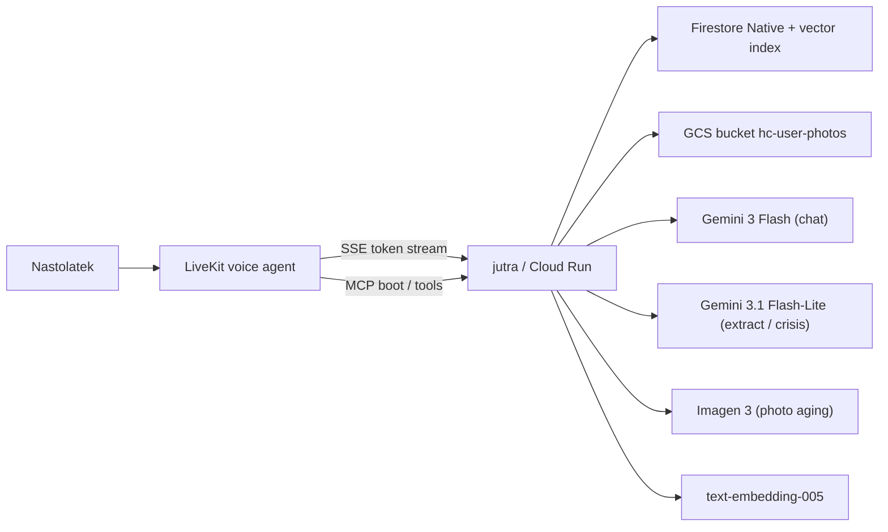

# jutra

> Rozmawiaj ze swoim cyfrowym "jutro". 15-letni Alex pyta siebie z przyszlosci
> o wazne decyzje. Backend buduje persone na bazie psychologicznych modeli
> (OCEAN + RIASEC + Chronicle), karmi ja postami z social mediow (RAG
> wektorowy) i zdjeciem postarzonym o ~10 lat (Imagen 3), a FutureSelf
> odpowiada zywym glosem przez LiveKit. Model **sam** dobiera, z jak odleglej
> przyszlosci mowi — brak sztywnych horyzontow.

24-godzinny projekt hackathonowy rozwijany dalej. Ten backend wystawia REST +
MCP + voice SSE (`/voice/chat-stream`) i jest konsumowany przez voice-UI na
LiveKit (prowadzone przez kolege).

## Architektura



- Agents: Google ADK 1.31 (`LlmAgent`, `SequentialAgent`, `Runner`) dla onboardingu;
  `FutureSelf` to bezposrednie wywolanie `google-genai` + fallback.
- LLMs (Vertex AI):
  - `gemini-3.1-pro-preview` — deep reasoning (zarezerwowane; dostepne przez `settings.model_reasoning`).
  - `gemini-3-flash-preview` — `FutureSelf` (chat) + `ConversationalOnboardingAgent`.
  - `gemini-3.1-flash-lite-preview` — ekstrakcja z postow / turow + klasyfikator kryzysu.
  - `gemini-2.5-flash` — automatyczny fallback gdy preview zniknie.
  - `imagen-3.0-capability-001` — identity-preserving photo aging (+10 lat).
- Embeddings: `text-embedding-005` (768 dim, `europe-west4`, Firestore vector search).
- Memory: Firestore Native (`eur3`). Layout: `users/{uid}` (pola: profil,
  `photos`, `context_notes`, `chat_history`), `.../chronicle`, `.../memories`,
  `.../posts` (z `embedding` jako Vector).
- Transport: FastAPI REST + MCP Streamable-HTTP + voice SSE (`/voice/chat-stream`)
  w jednym Cloud Run service.
- Deployment: Cloud Run `europe-west4`, `--min-instances=1` (tnie cold start).
- Consumer: LiveKit voice agent (patrz
  [`integrations/voice-worker-contract.md`](integrations/voice-worker-contract.md)).

### Dlaczego dwa regiony Vertex AI

Gemini 3 preview zyje tylko w `global`, `text-embedding-005` tylko w regionach.
[`jutra/infra/vertex.py`](jutra/infra/vertex.py) utrzymuje dwa dlugoterminowe
klienty `google-genai` (jeden z `location=global`, drugi z
`location=europe-west4`), kazda sciezka wywolania trafia na poprawny endpoint.
Dane aplikacji (Firestore `eur3`) i sam service Cloud Run zostaja w UE.

## Quickstart

```bash
cp .env.example .env
export GOOGLE_APPLICATION_CREDENTIALS=$PWD/jutra-493710-f25c69585e55.json
uv pip install --system -e ".[dev]"

make test          # 53 unit tests, zero live GCP
make run           # http://localhost:8080/readyz

# Drugie okno: seed demo persony alex_15 + live FutureSelf turn
MCP_BEARER_TOKEN=dev python3 scripts/seed.py http://127.0.0.1:8080/mcp/ --reset
```

## Deploy na Cloud Run

```bash
make deploy        # scripts/deploy.sh: APIs + build + deploy + smoke
make logs          # tail Cloud Run logow
make rollback      # do poprzedniej ready revision (pelny smoke check)
```

`scripts/deploy.sh` jest idempotentny (re-run tylko pushuje nowa rewizje).
Wdraza z `--min-instances=1 --max-instances=3 --memory=1Gi`, bierze
`MCP_BEARER_TOKEN` i `API_BEARER_TOKEN` z Secret Manager (`mcp-bearer:latest`)
i konczy zywym `scripts/mcp_smoke.py` na `$URL/mcp/`.

Live URL (po pierwszym `make deploy`): `.deploy_url` w repo
(`URL=https://jutra-{PROJECT-NUMBER}.{REGION}.run.app`).

## Integracja z LiveKit

Caly kontrakt Voice <-> Backend:

- [`integrations/voice-worker-contract.md`](integrations/voice-worker-contract.md) — kontrakt workera + system prompt + szkic kodu.
- [`integrations/mcp-tool-schemas.md`](integrations/mcp-tool-schemas.md) — schemy wszystkich 8 tooli.
- [`integrations/livekit-integration.md`](integrations/livekit-integration.md) — flow + dobre praktyki + test.

Lista narzedzi MCP (8 tooli):

| Tool | Kiedy |
|---|---|
| `start_conversational_onboarding` | nowy uzytkownik — pierwsze pytanie |
| `onboarding_turn_tool` | kazda odpowiedz uzytkownika w onboardingu |
| `ingest_social_media_text` | wklejone posty (do 50/wywolanie) |
| `ingest_social_media_export` | plik GDPR Twitter `tweets.js` / Instagram `posts_*.json` |
| `get_persona_snapshot(uid)` | OCEAN + top values + RIASEC (model sam dobiera perspektywe wieku) |
| `get_chronicle_tool(uid)` | graf wartosci / preferencji / faktow |
| `chat_with_future_self_tool(uid, msg, fast=false)` | jedna tura rozmowy; `fast=true` z voice'a |
| `detect_crisis_tool(message)` | pre-check kryzysu (offline od LLM-a) |

Transport MCP: `POST $URL/mcp/` (Streamable HTTP + JSON-RPC 2.0, shared bearer).

Dla voice-UI jest jeszcze szybsza sciezka **SSE**:

- `POST $URL/voice/chat-stream` — token stream Gemini (`meta` / `delta` / `done` / `error`), auth tym samym `MCP_BEARER_TOKEN`. LiveKit worker zaczyna TTS ~2 s szybciej niz na REST `POST /users/{uid}/chat`.

## Layout

```
jutra/
  personas/    OCEAN + RIASEC (agent sam dobiera perspektywe wieku)
  safety/      CrisisDetector + AiDisclosurePrefixer + PII redakcja + wrap_turn
  memory/      Firestore store + Chronicle + posts (vector) + context_notes
               + chat_history + save_turn extractor + wipe_user
  ingestion/   text_ingest + parsers/ (twitter_archive, instagram_json)
  agents/      FutureSelf + Onboarding + Extraction + prompts/
  services/    reused by REST + MCP: personas, chat (sync + stream),
               ingestion, photo_aging (Imagen 3), profile_gaps
  api/         FastAPI REST + voice SSE (/voice/chat-stream)
               + photo_routes + Bearer auth + OpenAPI
  mcp/         FastMCP streamable-http subapp + 8 tools
  infra/       Vertex clients (dual region) + Firestore + GCS
demo_data/
  alex_15/     profile + 6 onboarding answers + 30 tweets dla demo
scripts/
  deploy.sh               gcloud run deploy + smoke
  rollback.sh             traffic rollback do previous revision
  seed.py                 live end-to-end seed MCP (onboarding + ingest + chat)
  mcp_smoke.py            MCP smoke test przez oficjalne Python SDK
  setup-photo-feature.sh  jednorazowy bootstrap GCS + IAM + CORS dla zdjec
integrations/     kontrakt dla voice-UI (MCP schemas + worker contract)
```

## Etyka i bezpieczenstwo

- Kazda odpowiedz `chat_with_future_self` ma prefiks EU AI Act disclosure
  (`[Rozmawiasz z symulacja jutra (AI)...]`).
- Detektor kryzysu dziala dwuetapowo (keyword hot-list + Gemini 3 Flash-Lite
  rating 0..5). Severity >= 3 skraca pipeline: zwraca prosbe o kontakt +
  **116 111** (telefon zaufania dla dzieci i mlodziezy, 24/7, bezplatny) +
  **112** (alarm UE).
- PII (email / telefon / PESEL / IBAN / adres) jest redagowane przed kazdym
  wywolaniem LLM — patrz [`jutra/safety/pii.py`](jutra/safety/pii.py).
- Bearer token jest jedynym mechanizmem autoryzacji — wymiana miedzy backendem
  a LiveKit odbywa sie przez Secret Manager. Produkcyjnie potrzebny bylby
  OAuth Google + zgoda rodzicielska (GDPR art. 8) + DPIA + AI Act system card.
  To w backlogu: [`backlog.md`](backlog.md).

## Status wdrozenia

- `gcp-bootstrap` done: APIs enabled, SA z rolami Vertex + Firestore + Secret, Firestore `eur3` Native, composite index dla `chronicle`, vector index dla `posts.embedding`.
- `cloud-run` done: rewizja live, `/readyz` + `/mcp/` smoke green.
- `demo seed` done: alex_15 end-to-end (onboarding -> ingest -> persona -> FutureSelf chat).

## Co NIE weszlo w 24 h (i nadal w backlogu)

- Prawdziwy LiveKit pipe (robi kolega — kontrakt zamkniety w `integrations/`;
  backend ma juz SSE gotowe na streaming TTS).
- OAuth Google + Firestore security rules per-uid (teraz shared bearer).
- Realny Spotify / Instagram OAuth ingest (teraz eksporty GDPR + tekst-wklej).
- Dedykowany `ValuesReasonerAgent` z PB&J rationalization (teraz prompt-level).
- Evalset ADK + golden-set odpowiedzi + BigQuery observability.

Wiecej: [`backlog.md`](backlog.md).
