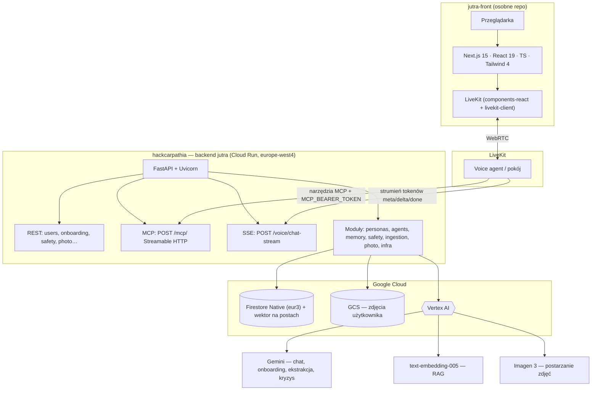

# Jutra — kontekst projektu (stan na kwiecień 2026)

Ten plik jest przeznaczony do wklejenia w **Replit** (lub inny asystent AI) jako krótki opis aktualnego stanu repozytorium **hackcarpathia** — backendu **jutra**. Nie zawiera sekretów; klucze i tokeny trzymaj w zmiennych środowiskowych Replit / Secrets.

---

## Czym jest jutra

- **Produkt:** rozmowa z „cyfrowym jutrem” dla nastolatków (PL): użytkownik buduje personę (OCEAN, wartości, RIASEC, Chronicle), opcjonalnie wkleja posty z sociali (RAG wektorowy w Firestore), może wgrać zdjęcie i dostać **jedną** wersję „trochę starsze ja” (+10 lat, Imagen 3).
- **Głos:** integracja z **LiveKit** — backend nie robi TTS/STT; wystawia **MCP** (narzędzia dla agenta) oraz **SSE** do szybkiego streamu tokenów odpowiedzi (`/voice/chat-stream`).
- **Bez sztywnych horyzontów:** model **sam** dobiera perspektywę czasową z kontekstu rozmowy (nie ma już parametrów 5/10/20/30 lat w API).

---

## Repozytoria

| Repozytorium | Rola |
|--------------|------|
| **hackcarpathia** (to repo) | Backend Python: FastAPI, MCP, Firestore, Vertex AI, GCS |
| **jutra-front** (osobne) | Next.js, UI „Retro-Future Sunset”, proxy do API, integracja LiveKit po stronie klienta |

---

## Architektura — pełny diagram



- **Podział Vertex AI:** część wywołań idzie przez `location=global` (preview Gemini), część przez region (np. `europe-west4` — embeddingi). Szczegóły: `jutra/infra/vertex.py`, `README.md`.
- **Głos:** TTS/STT realizuje **LiveKit** po stronie workera/klienta; ten backend dostarcza wyłącznie **MCP** (narzędzia) i **SSE** do szybkiego streamu odpowiedzi modelu.

---

## Pełny stack technologiczny

| Warstwa | Technologie |
|--------|-------------|
| **Frontend (jutra-front)** | Next.js 15, React 19, TypeScript, Tailwind CSS 4, pnpm; komponenty LiveKit; UI w stylu „Retro-Future Sunset”; proxy do API |
| **Voice / realtime** | LiveKit (pokój, worker); WebRTC z przeglądarki; worker wywołuje backend przez MCP i SSE |
| **Backend API (hackcarpathia)** | Python 3.11–3.12, FastAPI, Uvicorn, Pydantic v2, `python-multipart` |
| **Agenci i protokoły** | Google ADK (onboarding), `google-genai` (FutureSelf + fallback), pakiet `mcp` (serwer Streamable HTTP), `httpx`, `orjson`, `structlog` |
| **Modele (Vertex AI)** | m.in. `gemini-3-flash-preview`, `gemini-3.1-flash-lite-preview`, `text-embedding-005`, `imagen-3.0-capability-001`; opcjonalnie `gemini-2.5-flash` jako fallback |
| **Dane i pliki** | Firestore Native; GCS na zdjęcia; Secret Manager przy deployu (`mcp-bearer` itd.) |
| **Deploy** | Google Cloud Run (`europe-west4`, `min-instances=1`); lokalnie / Replit: `GOOGLE_APPLICATION_CREDENTIALS` + `.env` |

---

## Stack techniczny (backend)

- **Język:** Python 3.11–3.12 (`requires-python` w `pyproject.toml`).
- **API:** FastAPI + Uvicorn.
- **Agent framework:** Google ADK dla onboardingu; FutureSelf to bezpośrednie wywołania `google-genai` z fallbackiem modelu.
- **Modele (Vertex AI):** m.in. `gemini-3-flash-preview` (chat), `gemini-3.1-flash-lite-preview` (ekstrakcja / kryzys), `text-embedding-005` (768 wymiarów, RAG), `imagen-3.0-capability-001` (starzenie zdjęć), opcjonalnie `gemini-2.5-flash` jako fallback.
- **Dane:** Firestore Native (region danych `eur3`), indeks wektorowy na postach.
- **Pliki zdjęć:** Google Cloud Storage (np. bucket `hc-user-photos`), metadane w dokumencie użytkownika.
- **Deploy docelowy:** Google Cloud Run (`europe-west4`), `min-instances=1` (mniej cold startu).

---

## Transport i autoryzacja

- **REST** — wiele endpointów pod `/users/{uid}/...`, `/onboarding/...`, `/safety/...`; nagłówek `Authorization: Bearer <API_BEARER_TOKEN>` (gdy ustawiony).
- **MCP** — `POST {BASE_URL}/mcp/` (Streamable HTTP, JSON-RPC), ten sam sekret co voice w typowym ustawieniu: **`MCP_BEARER_TOKEN`**.
- **Voice SSE** — `POST {BASE_URL}/voice/chat-stream` (zdarzenia `meta`, `delta`, `done`, `error`); auth: **`MCP_BEARER_TOKEN`** (żeby worker nie potrzebował drugiego sekretu).
- **Produkcja:** tokeny z Secret Manager (`mcp-bearer` itd.). **Nie commituj** prawdziwych wartości — użyj `.env` / Replit Secrets.

---

## Narzędzia MCP (8 sztuk)

Brak `list_available_horizons` (usunięte).

1. `start_conversational_onboarding(uid)`
2. `onboarding_turn_tool(session_id, message)`
3. `ingest_social_media_text(uid, posts, platform=...)`
4. `ingest_social_media_export(uid, filename, raw)`
5. `get_persona_snapshot(uid)`
6. `get_chronicle_tool(uid, limit=50)`
7. `chat_with_future_self_tool(uid, message, display_name=..., base_age=..., use_rag=..., fast=...)` — `fast=true` dla voice
8. `detect_crisis_tool(message)`

Szczegóły: `integrations/mcp-tool-schemas.md`, kontrakt workera: `integrations/voice-worker-contract.md`.

---

## Ważniejsze endpointy REST (skrót)

- `GET /readyz` — health + metadane modeli
- `GET /users/{uid}/persona`, `GET /users/{uid}/chronicle`
- `POST /users/{uid}/chat` — jedna tura FutureSelf
- `GET /users/{uid}/chat/history?limit=200` — ostatnie tury chatu (role/text/ts) do zasilenia UI historii
- `POST /users/{uid}/photo/upload`, `GET .../photo/status`, `GET .../photo/aged/image`, `GET .../photo/original/image`
- `POST /voice/chat-stream` — SSE (Bearer MCP)

---

## Zmienne środowiskowe (orientacyjnie)

Skopiuj z `.env.example` w repozytorium. Typowo:

- `GOOGLE_CLOUD_PROJECT`, `GOOGLE_APPLICATION_CREDENTIALS`
- `LLM_LOCATION`, `EMBED_LOCATION`, nazwy modeli (`MODEL_CHAT`, `MODEL_EXTRACT`, `EMBED_MODEL`, `FALLBACK_MODEL`)
- `MCP_BEARER_TOKEN`, `API_BEARER_TOKEN`
- Dla zdjęć (w kodzie / deploy): bucket GCS i region obrazów (`gcs_bucket`, `image_location` w `jutra/settings.py`)

**Na Replit:** wgraj JSON service accounta jako secret pliku lub ustaw `GOOGLE_APPLICATION_CREDENTIALS` na ścieżkę do pliku w workspace (nie commituj pliku JSON).

---

## Uruchomienie lokalne (skrót)

```bash
cp .env.example .env
# ustaw GOOGLE_APPLICATION_CREDENTIALS na ścieżkę do klucza SA
pip install -e ".[dev]"   # lub uv pip install ...
make test    # ~53 szybkie testy jednostkowe bez live GCP
make run     # http://localhost:8080/readyz
```

Opcjonalnie: `MCP_BEARER_TOKEN=dev python scripts/mcp_smoke.py`, `python scripts/seed.py http://127.0.0.1:8080/mcp/`.

---

## Bezpieczeństwo i zgodność (aktualna implementacja)

- Prefiks ujawnienia AI przed odpowiedzią (symulacja „jutra”).
- Detektor kryzysu (słowa + model); przy wysokim ryzyku — kierunek na **116 111** / **112** (szczegóły w kodzie `jutra/safety/`).
- Redakcja PII przed LLM (`jutra/safety/pii.py`).
- Brak prawdziwego OAuth per użytkownik w obecnym hackathonowym trybie — w backlogu: zgody rodzica (GDPR art. 8), twardsze reguły Firestore itd.

---

## Stan funkcji (high level)

**Jest:** persona + chronicle + ingest tekstu/eksportu GDPR, chat FutureSelf, RAG z postów, crisis path, zdjęcie +10 lat (GCS + Imagen), SSE voice, MCP 8 narzędzi, testy jednostkowe, deploy Cloud Run (szczegóły w `README.md`).

**Backlog (skrót):** pełny worker LiveKit produkcyjny, OAuth i reguły per `uid`, ingest OAuth (Spotify/IG), evalset, observability — patrz `backlog.md`.

---

## Dokumentacja w repo

- `README.md` — przegląd architektury i quickstart
- `CHANGELOG.md` — historia zmian (w tym usunięcie horyzontów, voice SSE, jedno zdjęcie)
- `integrations/*.md` — kontrakty dla voice / MCP
- `docs/pitch/` — deck PDF (opcjonalnie `make pitch`)

---

## Jak używać tego pliku w Replit

1. Skopiuj zawartość **REPLIT_CONTEXT.md** do system promptu / „Project context” / notatki projekowej.
2. Dodaj osobno **tylko** to, czego ten plik nie zawiera: URL wdrożenia (jeśli publiczny), nazwa bucketa GCS, ewentualnie fragment `.env` **bez** wartości sekretów.
3. Przy zmianach w kodzie zaktualizuj ten plik ręcznie lub poproś asystenta o synchronizację z `README.md` / `CHANGELOG.md`.
