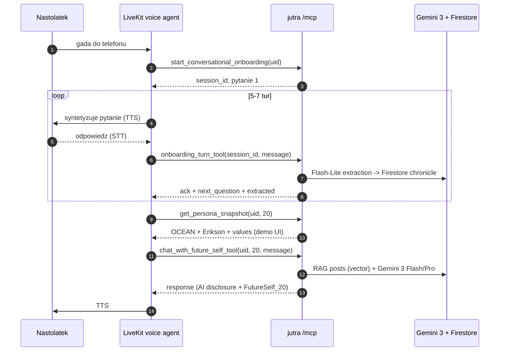

# LiveKit voice agent — integracja z jutra MCP

Ten dokument zamyka kontrakt między backendem **jutra** a voice-UI na LiveKit (prowadzonym przez kolegę). Backend NIE robi UI ani syntezy głosu — wystawia wyłącznie REST (fallback) i MCP (Streamable HTTP + JSON-RPC 2.0).

## Adresy

| Env | REST | MCP |
|---|---|---|
| local | `http://127.0.0.1:8080` | `http://127.0.0.1:8080/mcp/` |
| prod  | `https://jutra-<hash>-ew.a.run.app` | `https://jutra-<hash>-ew.a.run.app/mcp/` |

Po deployu URL wydrukuje `./scripts/deploy.sh`.

## Auth

- Shared secret Bearer na obu transportach.
- Wartość w Secret Manager: `mcp-bearer` (GCP project `jutra-493710`).
- Odczyt przez kolegę: `gcloud secrets versions access latest --secret=mcp-bearer --project=jutra-493710`
- Nagłówek: `Authorization: Bearer <value>`.

## Flow podstawowy (onboarding + chat)



## Tools w skrócie

Pelne schemy: [`mcp-tool-schemas.md`](./mcp-tool-schemas.md).

| Tool | Kiedy wołać |
|---|---|
| `list_available_horizons` | raz na początku sesji aby podbić ten sam komponent UI po horyzontach |
| `start_conversational_onboarding` | pierwsze logowanie — przed chat_with_future_self |
| `onboarding_turn_tool` | każda wypowiedź użytkownika w trakcie onboardingu |
| `ingest_social_media_text` | wkleiłeś posty (demo: 30 tweetów) |
| `ingest_social_media_export` | użytkownik podał plik GDPR (`tweets.js` / `posts_*.json`) |
| `get_persona_snapshot(uid, 5/10/20/30)` | pokazujesz radar OCEAN + wiek + stadium |
| `get_chronicle_tool(uid)` | UI "tablica wartości i preferencji" |
| `chat_with_future_self_tool(uid, horizon, msg)` | każda wypowiedź użytkownika w trybie rozmowy z przyszłym ja |
| `detect_crisis_tool(msg)` | opcjonalnie — szybki pre-check zanim dojdzie do chat |

## Dobre praktyki dla voice-UI

1. **Imię**: `display_name` w `chat_with_future_self_tool` nadpisuje `"Ty"` w systemie promptu. Przekaż tam imię z LiveKit identity.
2. **Disclaimer**: pierwsza sentencja każdej odpowiedzi zawiera prefix `[Rozmawiasz z symulacja jutra (AI)...]` — zostaw to w TTS lub wytnij pierwszą linię TYLKO wtedy, gdy UI pokazuje wizualny chip "AI Simulation".
3. **Kryzys**: jeśli `chat_with_future_self_tool` zwróci `crisis=true`, TTS-uj odpowiedź bez obcinania, nie próbuj kolejnej tury z FutureSelf. Użytkownik MUSI usłyszeć numery.
4. **Cold start**: backend na Cloud Run ma `--min-instances=1`, więc pierwsza tura ~1-2s. Dorzuć lokalny bufor jeśli masz.
5. **PII**: żadnego wrzucania PII (imię + nazwisko, adres, telefon) do tła rozmowy — backend i tak to redakcjonuje, ale niech to nie wychodzi z mikrofonu.

## Testowanie lokalne

```bash
# Terminal 1 — backend
cd hackcarpathia
API_BEARER_TOKEN=dev MCP_BEARER_TOKEN=dev make run

# Terminal 2 — smoke MCP (używa oficjalnego Python SDK)
MCP_BEARER_TOKEN=dev python3 scripts/mcp_smoke.py http://127.0.0.1:8080/mcp/
```

MCP Inspector (TypeScript):

```bash
npx @modelcontextprotocol/inspector
# URL:    http://127.0.0.1:8080/mcp/
# Auth:   Bearer dev
# Transport: Streamable HTTP
```

## Model fallback

Gemini 3 preview może być wyłączone z 2-tygodniowym wyprzedzeniem (patrz `.env.example` — `FALLBACK_MODEL=gemini-2.5-flash`). Kod backendu automatycznie przełącza się na fallback na `NotFound`/`FailedPrecondition`, więc z Twojej strony nic nie trzeba zmieniać — jeśli odpowiedzi nagle spowolnieją / zubożeją, to znak, że lecisz na `gemini-2.5-flash`.
