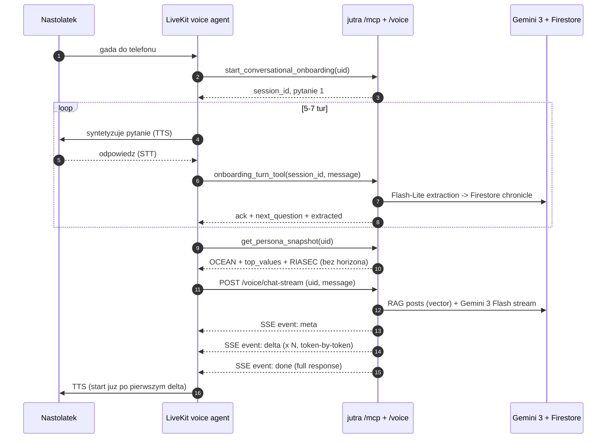

# LiveKit voice agent — integracja z jutra (MCP + SSE)

Ten dokument zamyka kontrakt między backendem **jutra** a voice-UI na LiveKit (prowadzonym przez kolegę). Backend NIE robi UI ani syntezy głosu — wystawia REST (fallback), MCP (Streamable HTTP + JSON-RPC 2.0) oraz SSE token-stream dla voice'a (`/voice/chat-stream`).

## Adresy

| Env | REST | MCP | Voice SSE |
|---|---|---|---|
| local | `http://127.0.0.1:8080` | `http://127.0.0.1:8080/mcp/` | `http://127.0.0.1:8080/voice/chat-stream` |
| prod  | `https://jutra-<hash>-ew.a.run.app` | `https://jutra-<hash>-ew.a.run.app/mcp/` | `https://jutra-<hash>-ew.a.run.app/voice/chat-stream` |

Po deployu URL wydrukuje `./scripts/deploy.sh`. Plik `.deploy_url` trzyma aktualny URL.

## Auth

- Shared secret Bearer na wszystkich transportach (REST admin: `API_BEARER_TOKEN`; MCP + voice: `MCP_BEARER_TOKEN`).
- Wartość w Secret Manager: `mcp-bearer` (GCP project `jutra-493710`).
- Odczyt przez kolegę: `gcloud secrets versions access latest --secret=mcp-bearer --project=jutra-493710`.
- Nagłówek: `Authorization: Bearer <value>`.
- **W hackathonie tokeny są puste** — frontend i worker przechodzą bez Bearer. W produkcji przywróć tokeny.

## Flow podstawowy (onboarding + chat)



Agent **sam** dobiera, jak daleko w przyszłość mówi (5, 10, 20 czy 30 lat) — zależnie od kontekstu rozmowy i base_age użytkownika. Nie przekazujesz `horizon`.

## Tools w skrócie

Pełne schemy: [`mcp-tool-schemas.md`](./mcp-tool-schemas.md).
Kontrakt workera (prompt + szkic kodu): [`voice-worker-contract.md`](./voice-worker-contract.md).

| Tool | Kiedy wołać |
|---|---|
| `start_conversational_onboarding` | pierwsze logowanie — przed chat |
| `onboarding_turn_tool` | każda wypowiedź użytkownika w trakcie onboardingu |
| `ingest_social_media_text` | wkleiłeś posty (demo: 30 tweetów) |
| `ingest_social_media_export` | użytkownik podał plik GDPR (`tweets.js` / `posts_*.json`) |
| `get_persona_snapshot(uid)` | pokazujesz radar OCEAN + top_values |
| `get_chronicle_tool(uid)` | UI "tablica wartości i preferencji" |
| `chat_with_future_self_tool(uid, msg, fast=true)` | REST/MCP chat (np. fallback w tekstowym UI) |
| `POST /voice/chat-stream` | **preferowana ścieżka voice**: SSE token-stream |
| `detect_crisis_tool(msg)` | opcjonalnie — szybki pre-check zanim dojdzie do chat |

## Dobre praktyki dla voice-UI

1. **Imię**: `display_name` w `chat_with_future_self_tool` / body `/voice/chat-stream` nadpisuje `"Ty"` w systemie promptu. Przekaż tam imię z LiveKit identity / `participant.metadata`.
2. **base_age**: jeśli UI zna wiek użytkownika, przekaż `base_age` raz — backend zapisuje go do Firestore i kolejne tury go używają.
3. **Disclaimer**: pierwsza sentencja każdej odpowiedzi zawiera prefix `[Rozmawiasz z symulacją jutra (AI)...]` — zostaw to w TTS lub wytnij pierwszą linię TYLKO wtedy, gdy UI pokazuje wizualny chip "AI Simulation".
4. **Kryzys**: jeśli `chat_with_future_self_tool` / voice SSE zwróci `crisis=true` w evencie `meta`, TTS-uj całą odpowiedź bez obcinania, nie próbuj kolejnej tury z FutureSelf. Użytkownik MUSI usłyszeć numery.
5. **Cold start**: backend na Cloud Run ma `--min-instances=1`, więc pierwsza tura ~1–2 s. SSE dodatkowo tnie TTFB, bo TTS zaczyna po pierwszym `delta`.
6. **PII**: żadnego wrzucania PII (imię + nazwisko, adres, telefon) do tła rozmowy — backend i tak to redakcjonuje, ale niech to nie wychodzi z mikrofonu.

## Testowanie lokalne

```bash
# Terminal 1 — backend
cd hackcarpathia
API_BEARER_TOKEN=dev MCP_BEARER_TOKEN=dev make run

# Terminal 2 — smoke MCP (używa oficjalnego Python SDK)
MCP_BEARER_TOKEN=dev python3 scripts/mcp_smoke.py http://127.0.0.1:8080/mcp/

# Terminal 2 — smoke voice SSE
curl -N -H "Authorization: Bearer dev" \
     -H "Content-Type: application/json" \
     -d '{"uid":"alex-15","message":"Czesc, co sadzisz o pianie?"}' \
     http://127.0.0.1:8080/voice/chat-stream
```

MCP Inspector (TypeScript):

```bash
npx @modelcontextprotocol/inspector
# URL:    http://127.0.0.1:8080/mcp/
# Auth:   Bearer dev
# Transport: Streamable HTTP
```

## Model fallback

Gemini 3 preview może być wyłączone z 2-tygodniowym wyprzedzeniem (patrz `.env.example` — `FALLBACK_MODEL=gemini-2.5-flash`). Kod backendu automatycznie przełącza się na fallback na `NotFound`/`FailedPrecondition`, więc z Twojej strony nic nie trzeba zmieniać — jeśli odpowiedzi nagle spowolnieją / zubożeją, to znak, że lecisz na `gemini-2.5-flash`.
